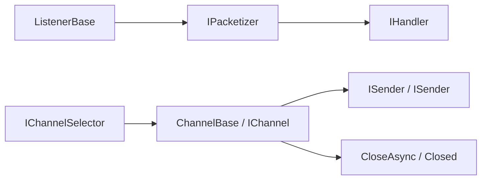

# General Communication

Conventional communication abstraction breaks down "how to send, how to receive, how to monitor, how to close the channel, how to package and unpack" into several groups of small interfaces. The core framework only defines protocol boundaries, and the implementation of specific network connections, message queue connections, event channels, etc. is undertaken by `Zongsoft.Net`, `Zongsoft.Messaging.*` or other extension projects.

## Type Relationship

| Type | Description |
| --- | --- |
| `ISender` | Send bytes of data. |
| `ISender<T>` | Send strongly typed packets. |
| `IReceiver` | Receive [`ReadOnlySequence<byte>`](https://learn.microsoft.com/en-us/dotnet/api/system.buffers.readonlysequence-1) _[Source](https://source.dot.net/#System.Memory/ReadOnlySequence.cs)_ byte sequence. |
| `IListener<T>` | Listens for and handles strongly typed communication packets. |
| `ListenerBase<T>` | The listener base class implements the process of receiving, unpacking and handing over to the handler. |
| `IChannel` | A communication channel that can be closed and released asynchronously. |
| `ChannelBase` | The channel base class unifies the closing status, closing events and release process. |
| `IChannelSelector<T>` | Select a channel by key. |
| `IPacketizer<TPackage>` | Strongly typed Packaging and unpacking interface for communication packets. |
| `IPacketizer<TRequest, TResponse>` | Request packaging and response unpacking interface in request/response mode. |


There is no independent `Listener` type in the source code; the current listener concept is carried by `IListener<T>` and `ListenerBase<T>`, with `Zongsoft.Net.TcpServer<T>` being a typical implementation.


## Channel Design Ideas

`Channel` is the lifecycle abstraction of "communication endpoint", not a synonym for a certain protocol. It expresses: whether this endpoint is closed, how to close it, how to notify the outside after closing, and whether it can be held by a selector or manager.



This design allows different communication forms to share the same lifecycle vocabulary:

* TCP connection channel: `TcpChannelBase<T>` inherits `ChannelBase` and implements `ISender` and `ISender<T>` at the same time.
* Event channel: `IEventChannel` inherits `IChannel` and `ISender<EventContext>` and can send events to the remote end.
* Message queue channel: `ZeroQueueEventChannel` inherits `ChannelBase`, encodes events and delivers them to the ZeroMQ queue.
* Message consumer: `MessageConsumerBase<TQueue>` inherits `ChannelBase` and incorporates the subscription lifecycle into the channel closing model.

## Receiving and Unpacking

`ListenerBase<T>` implements the template process from bytes to strongly typed packets: `IPacketizer<T>.Unpack` is called after receiving the byte sequence, and handler is called after the unpacking is successful.

Source: [framework/Zongsoft.Core/src/Communication/ListenerBase.cs](https://github.com/Zongsoft/framework/blob/main/Zongsoft.Core/src/Communication/ListenerBase.cs#L61) (excerpt; see source for context).


```csharp
protected virtual ValueTask OnReceiveAsync(in ReadOnlySequence<byte> data, CancellationToken cancellation)
{
	var message = data;

	if(this.OnDeserialize(ref message, out var value))
	{
		var task = this.OnHandleAsync(value, cancellation);

		if(!task.IsCompletedSuccessfully)
			return new ValueTask(task.AsTask());
	}

	return ValueTask.CompletedTask;
}
```


`IPacketizer<T>` is suitable for handling sticky packets, half packets, length headers, compression, encryption and custom binary protocols. Its `Unpack` receives `ref ReadOnlySequence<byte>`, and the implementer can advance the sequence after unpacking a packet, letting the upper layer continue processing subsequent packets in the buffer.

Source: [framework/Zongsoft.Core/src/Communication/IPacketizer.cs](https://github.com/Zongsoft/framework/blob/main/Zongsoft.Core/src/Communication/IPacketizer.cs#L39) (excerpt; see source for context).


```csharp
public interface IPacketizer<TPackage>
{
	/// <summary>打包，将通讯包对象序列化到发送缓存。</summary>
	/// <param name="writer">缓存写入器。</param>
	/// <param name="package">待打包的通讯包。</param>
	void Pack(IBufferWriter<byte> writer, in TPackage package);

	/// <summary>拆包，将字节流反序列化成通讯包对象。</summary>
	/// <param name="data">待拆包的字节流。</param>
	/// <param name="package">拆包成功的通讯包。</param>
	/// <returns>如果拆包完成则返回真(<c>True</c>)，否则返回假(<c>False</c>)。</returns>
	bool Unpack(ref ReadOnlySequence<byte> data, out TPackage package);
}
```


## Implementation in Zongsoft.Net

`Zongsoft.Net` applies these abstractions to TCP network communication:

* `TcpServer<T>` inherits `ListenerBase<T>`, holds `IPacketizer<T>`, and is responsible for monitoring and creating TCP channels.
* `TcpChannelBase<T>` inherits `ChannelBase` and is responsible for sending, receiving, packaging, unpacking and closing of a single connection.
* `TcpServerChannelManager<T>` maintains the server channel collection and creates channels when the client connects.
* `Packetizer` provides two basic unpacking implementations: headless packet and length header packet.

Source: [framework/Zongsoft.Net/samples/server/Program.cs](https://github.com/Zongsoft/framework/blob/main/Zongsoft.Net/samples/server/Program.cs#L18) (excerpt; see source for context).


```csharp
var server = TcpServer.Headed;
server.Handler = new Handler(server);
await server.StartAsync(args.Length == 0 ? ["127.0.0.1", "7969"] : args);
```


The above TCP server example comes from the framework; Handler is an internal type of the same Program.cs and broadcasts an ACK reply after receiving the text. Discussions does not host TCP channels directly. See [Network Communication](../../net.md) for the supporting client, startup parameters and shutdown behavior.

## Realistic Scene

The channel model is suitable for any scenario that has an open/close lifecycle and can send or receive data. Network connections are just one of them; event buses, message queue subscriptions, device connections, and gateway sessions can also become channels.

<details>
<summary>When do you need to implement your own Channel?</summary>

* Need to manage a closeable remote connection, such as WebSocket, TCP, serial port or device session.
* Message queue subscriptions need to be encapsulated into releasable objects.
* Close events need to be handled uniformly to prevent the caller from directly relying on the underlying driver.
* Need to select the sending channel based on tenant, user, device or topic via `IChannelSelector<T>`.

</details>

## Related Resources

* [ISender.cs](https://github.com/Zongsoft/framework/blob/main/Zongsoft.Core/src/Communication/ISender.cs)
* [ISender&lt;T&gt;.cs](https://github.com/Zongsoft/framework/blob/main/Zongsoft.Core/src/Communication/ISender%601.cs)
* [IReceiver.cs](https://github.com/Zongsoft/framework/blob/main/Zongsoft.Core/src/Communication/IReceiver.cs)
* [IListener.cs](https://github.com/Zongsoft/framework/blob/main/Zongsoft.Core/src/Communication/IListener.cs)
* [ListenerBase.cs](https://github.com/Zongsoft/framework/blob/main/Zongsoft.Core/src/Communication/ListenerBase.cs)
* [IChannel.cs](https://github.com/Zongsoft/framework/blob/main/Zongsoft.Core/src/Communication/IChannel.cs)
* [ChannelBase.cs](https://github.com/Zongsoft/framework/blob/main/Zongsoft.Core/src/Communication/ChannelBase.cs)
* [IChannelSelector.cs](https://github.com/Zongsoft/framework/blob/main/Zongsoft.Core/src/Communication/IChannelSelector.cs)
* [IPacketizer.cs](https://github.com/Zongsoft/framework/blob/main/Zongsoft.Core/src/Communication/IPacketizer.cs)
* [Zongsoft.Net README](https://github.com/Zongsoft/framework/blob/main/Zongsoft.Net/README.md)
* [TcpChannelBase.cs](https://github.com/Zongsoft/framework/blob/main/Zongsoft.Net/src/TcpChannelBase.cs)
* [ZeroQueueEventChannel.cs](https://github.com/Zongsoft/framework/blob/main/messaging/zero/src/ZeroQueueEventChannel.cs)
