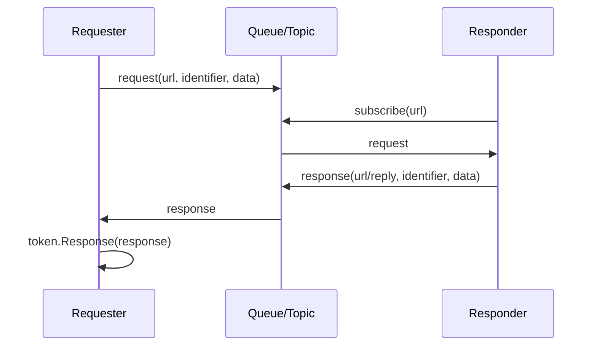

# Request/Response

The request response abstraction is used in message-based communication to "initiate a request, wait for one or more responses, and associate results by request identification." It is not an HTTP request model, nor is it only one question and one answer; a request can receive multiple responses, and the caller obtains the arrived response through `IRequestToken`.

## Type Relationship

| Type | Description |
| --- | --- |
| `IRequest` | Request object, including `Url`, `Identifier` and request data. |
| `IRequestToken` | Request token, responsible for enumerating the responses corresponding to the current request. |
| `IRequester` | The request initiator is responsible for sending requests and receiving response callbacks. |
| `IResponder` | The request handler is responsible for receiving requests and sending responses. |
| `IResponse` | Response object, including response address, response data and associated requests. |

## What Problem Does It Solve

Systems such as message queues, ZeroMQ, and event buses usually do not have naturally synchronized return values. The request response model divides a business request into three things:

1. The requester sends a request message with `Identifier`.
2. The responder processes the request and writes the same `Identifier` back into the response message.
3. After the requester receives the response, it finds the request token based on `Identifier` and puts the response into the token.



## Make a Request

Discussions' HTTP controller does not use this set of request-response abstractions. The following uses ZeroMQ's existing rpc/echo test: ZeroServerScope starts the test Broker, the two queues are responsible for requests and responses respectively, and the EchoHandler returns the payload as it is. The complete test relies on the same directory fixture and is controlled by the Global.IsTestingEnabled switch.

The requester will get `IRequestToken` after calling `RequestAsync`. This token is not the response itself, but the response collector; the caller can enumerate the arriving responses immediately, or give it a wait time.

Source: [framework/messaging/zero/test/ZeroRequesterTests.cs](https://github.com/Zongsoft/framework/blob/main/messaging/zero/test/ZeroRequesterTests.cs#L16) (excerpt; see source for context).


```csharp
public async Task RequesterReceivesImmediateResponses()
{
	if(!Global.IsTestingEnabled)
		return;

	using var server = await ZeroServerScope.StartAsync();
	using var requesterQueue = ZeroTestUtility.CreateQueue(server.Port, "requester");
	using var responderQueue = ZeroTestUtility.CreateQueue(server.Port, "responder");

	var responder = new ZeroResponder { Queue = responderQueue };
	responder.Handlers.Add(new EchoHandler());
	await responder.StartAsync([]);

	try
	{
		await using var requester = new ZeroRequester { Queue = requesterQueue };

		for(int i = 0; i < 20; i++)
		{
			using var token = await requester.RequestAsync("rpc/echo", Encoding.UTF8.GetBytes($"message-{i}"));
			Assert.NotNull(token);

			var response = token.GetResponses(TimeSpan.FromSeconds(5)).FirstOrDefault();
			Assert.NotNull(response);
			Assert.Equal($"message-{i}", Encoding.UTF8.GetString(response.Data.Span));
			Assert.Equal(token.Request.Identifier, response.Request.Identifier);
		}
	}
	finally
	{
		await responder.StopAsync([]);
		((IDisposable)responder).Dispose();
	}
}
```


If the business only allows one response, just take the first one when traversing; if multiple service nodes are allowed to respond at the same time, multiple responses can be collected, sorted, aggregated or prioritized together.

## Handle Requests and Respond

The responder usually injects `IResponder` into the parameters of the request handler. After getting the request, the handler calls `request.Response(...)` to create an associated response, and then calls `RespondAsync` to send it back.

Source: [framework/messaging/zero/test/ZeroTestUtility.cs](https://github.com/Zongsoft/framework/blob/main/messaging/zero/test/ZeroTestUtility.cs#L357) (excerpt; see source for context).


```csharp
[Handler("rpc/echo")]
internal sealed class EchoHandler : HandlerBase<IRequest>
{
	protected override async ValueTask OnHandleAsync(IRequest request, Parameters parameters, CancellationToken cancellation)
	{
		var responder = parameters.GetValue<IResponder>();
		Assert.NotNull(responder);
		await responder.RespondAsync(request.Response(request.Data), cancellation);
	}
}
```


The route declaration of EchoHandler is rpc/echo, and the response is generated by request.Response(request.Data), which retains request-related information. It is a test fixture, not a Discussions business handler.

## ZeroMQ Implementation Key Points

The implementation in `messaging/zero` can help understand this set of interfaces:

* `ZeroRequest` packages the request identifier and request data into `identifier + '\n' + data`.
* `ZeroRequester` first registers the token into the pending collection, then subscribes to `url + "/reply"` before sending the request, and then requests `url` delivery.
* `ZeroResponse` also packages `identifier + '\n' + data` into the response message.
* `ZeroResponder` subscribes to the request topic according to the handler URL and calls the handler after receiving the request.
* After receiving the response, `ZeroRequester.Adapter` unpacks the identifier, finds the corresponding token, and puts the response into the token.

Source: [framework/messaging/zero/src/ZeroRequester.cs](https://github.com/Zongsoft/framework/blob/main/messaging/zero/src/ZeroRequester.cs#L97) (excerpt; see source for context).


```csharp
public async ValueTask<IRequestToken> RequestAsync(string url, ReadOnlyMemory<byte> data, CancellationToken cancellation = default)
{
	if(Volatile.Read(ref _disposed) != 0)
		throw new ObjectDisposedException(nameof(ZeroRequester));

	var queue = this.Queue;
	if(queue == null)
		return null;

	var request = new ZeroRequest(url, data);
	var token = new Token(request, request => this.Remove(request.Identifier));

	if(!_tokens.TryAdd(request.Identifier, token))
		return null;

	try
	{
		await this.SubscribeAsync(queue, url + "/reply", cancellation);
		await queue.ProduceAsync(url, request.Pack(), null, cancellation);
		return token;
	}
	catch
	{
		token.Dispose();
		throw;
	}
}
```



`IRequestToken.GetResponses(timeout)` will wait for the response during the traversal, which is suitable for short-term waiting; when listening for a long time or processing the response in real time, it is more suitable to handle the callback of `IRequester.OnRespondedAsync` through the response handler.


Request registration occurs before sending, so the adapter can find the token even if the response arrives immediately. This token will be released when sending or subscribing fails; the initialization task of the same reply topic will be reused. The caller should still release the token after using the response, and cannot assume that all unresponsive requests will be cleaned regularly; the current expiration cache is set when the response is received.

ZeroRequester owns reply subscriptions and pending requests, and releasing it cleans up these resources; the queue it uses is provided externally. Replacing the Queue with another instance is not allowed after a subscription has been established.

## Related Resources

* [IRequest.cs](https://github.com/Zongsoft/framework/blob/main/Zongsoft.Core/src/Communication/IRequest.cs)
* [IRequestToken.cs](https://github.com/Zongsoft/framework/blob/main/Zongsoft.Core/src/Communication/IRequestToken.cs)
* [IRequester.cs](https://github.com/Zongsoft/framework/blob/main/Zongsoft.Core/src/Communication/IRequester.cs)
* [IResponse.cs](https://github.com/Zongsoft/framework/blob/main/Zongsoft.Core/src/Communication/IResponse.cs)
* [IResponder.cs](https://github.com/Zongsoft/framework/blob/main/Zongsoft.Core/src/Communication/IResponder.cs)
* [ZeroRequester.cs](https://github.com/Zongsoft/framework/blob/main/messaging/zero/src/ZeroRequester.cs)
* [ZeroResponder.cs](https://github.com/Zongsoft/framework/blob/main/messaging/zero/src/ZeroResponder.cs)
* [ZeroRequest.cs](https://github.com/Zongsoft/framework/blob/main/messaging/zero/src/ZeroRequest.cs)
* [ZeroResponse.cs](https://github.com/Zongsoft/framework/blob/main/messaging/zero/src/ZeroResponse.cs)
