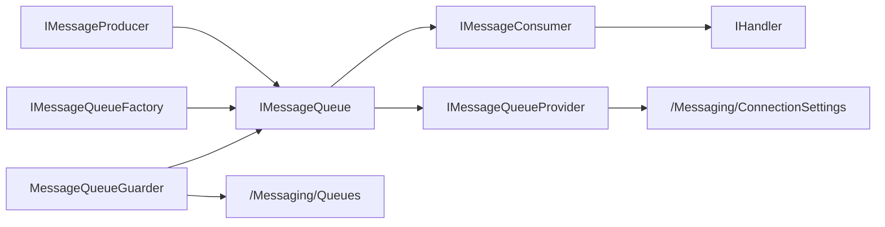

# Zongsoft.Messaging

`Zongsoft.Messaging` is the message queue abstraction layer in the core library. It does not bind a certain protocol of Kafka, RabbitMQ, MQTT or ZeroMQ, but extracts the concepts that the application side really needs stable dependencies: producing messages, subscribing to topics, processing messages, confirming consumption, creating queues according to configuration, and guarding a set of subscriptions in the host.

The specific message queue is provided by [Message queue plugin](../messaging.md). Business modules should rely on core abstractions first, and only reference specific implementation packages when they need to configure driver-specific parameters, directly construct driver queues, or use ZeroMQ additional communication capabilities.

## Design Positioning

The core concept of message queue abstraction is "unify the entrance and retain semantic boundaries":

* Unified entrance: The publisher sends byte or text messages through `IMessageProducer`; the subscriber subscribes to the topic through `IMessageQueue` and obtains `IMessageConsumer`.
* Unified Messaging: What all implementations ultimately give to the handler is `Message`, which contains topic, label, message body, identifier, sender identity, timestamp and confirmation callback.
* Unified configuration: The plugin registers the connection setting driver to `/Workbench/Configuration/ConnectionSettings/Drivers`, and the queue provider reads the connection items from `/Messaging/ConnectionSettings`.
* Preserving boundaries: `MessageReliability`, label, delay, expiration, priority and other options are framework intentions and do not mean that every underlying product supports the same semantics. The core layer checks for reliability caps, positive delays, and non-empty compression settings; rejects calls if not supported. The specific mapping of other options still needs to be checked with the driver.



## Main Types

| Type | Description |
| --- | --- |
| `Message` | Message structure, carrying topic, tags, data, identifier, identity, timestamp and confirmation callback. |
| `IMessageProducer` | Producer interface, providing methods to send byte or text messages by default topic, specified topic and specified label. |
| `IMessageQueue` | Queue interface, inherits `IMessageProducer`, adds queue name, release status and subscription capabilities. |
| `IMessageConsumer` | The consumer interface represents a subscription; it inherits the shutdown model of [communication channel](communication/general.md) and can cancel the subscription. |
| `IMessageQueueFactory` | Queue factory that creates queue instances based on connection settings or connection strings. |
| `IMessageQueueProvider` | A queue provider that discovers and reuses queue instances by name from the application configuration. |
| `MessageQueueBase<TSubscriber>` | Queue base class, which implements send and subscription overloads, default topic resolution, subscription collection and release processes. |
| `MessageConsumerBase<TQueue>` | The consumer base class incorporates the subscription lifecycle into the [Channel](communication/general.md) shutdown model. |
| `MessageQueueGuarder` | Host [worker](https://github.com/Zongsoft/framework/blob/main/Zongsoft.Core/src/Components/IWorker.cs), starts a set of subscriptions according to configuration, and cancels subscriptions when stopped. |

The handler uses [`IHandler<T>`](components/handler.md) to undertake the message processing logic. In this way, the subscription callback can be a simple delegate or a reusable, injectable, and composable handler object.

## Message Model

`Message` is a lightweight structure. The focus is not on describing all middleware fields, but on providing the smallest message unit that can be expressed across implementations:

| Properties | Description |
| --- | --- |
| `Topic` | Topic name. The implementation may convert the topic. For example, RabbitMQ converts `/` into `.`, and ZeroMQ puts the grouping prefix in front of the topic. |
| `Tags` | Label text. The core layer supports passing tags, but whether the specific implementation is used for filtering depends on the driver. |
| `Data` | Message body byte array. The text sending overload will use the specified encoding, which defaults to UTF-8. |
| `Identifier` | Message identifier, usually returned or populated by the underlying implementation. |
| `Identity` | Message sender or client identity, only some implementations set this. |
| `Timestamp` | Message timestamp; new messages use UTC time by default, and some implementations will use the underlying message time. |
| `IsEmpty` | True when the data is empty; used by the poller to indicate that no valid message was received. |

`Message.Acknowledge()` and `Message.AcknowledgeAsync()` call the confirmation callback carried in the message. The specific effect of the confirmation is determined by the implementation: Kafka submits offset, RabbitMQ sends `BasicAck`, MQTT calls the confirmation method of MQTTnet, ZeroMQ's `LeastOnce` is confirmed through the Control channel, and `MostOnce` has no reliable confirmation. Kafka's current configuration does not turn off automatic client submission, and explicit Commit does not guarantee that unconfirmed messages will be re-submitted.


Don't confuse "received message" with "message has been confirmed by the middleware". If you need at least once processing semantics when subscribing to a handler, you should call `AcknowledgeAsync()` after the business processing is successful; if the handler never confirms, implementations such as Kafka, RabbitMQ, and MQTT may retain the unconfirmed status or re-deliver according to their respective protocols.


## Production News

The production interface provides two sets of overloads for bytes and text. The caller can only pass the message body and let the queue take the default topic from `Topic` in the connection settings; it can also explicitly pass in the topic and label.

Discussions' site messages are stored in the database and do not use middleware queues directly. This section uses the framework's existing capability boundary testing; TestQueue is a memory fixture in the same test file and will not connect to the Broker. See [Kafka project](../messaging/projects/kafka.md) for the complete client for sending messages.

Source: [framework/Zongsoft.Core/test/Messaging/MessageQueueBaseTest.cs](https://github.com/Zongsoft/framework/blob/main/Zongsoft.Core/test/Messaging/MessageQueueBaseTest.cs#L59) (excerpt; see source for context).


```csharp
public async Task UnsupportedDelayFailsBeforeDriverOperation()
{
	using var queue = new TestQueue();
	var options = new MessageEnqueueOptions(TimeSpan.FromSeconds(1));

	var exception = await Assert.ThrowsAsync<OperationException>(() => queue.ProduceAsync("tests/delay", ReadOnlyMemory<byte>.Empty, options).AsTask());

	Assert.Equal(nameof(OperationException.Unsupported), exception.Reason);
	Assert.Contains(MessageQueueFeature.Delay.Name, exception.Message);
	Assert.Equal(0, queue.ProduceCount);
}
```


The test requests a one-second delay, but the queue does not declare a Delay capability, so it fails before calling the driver and the ProduceCount remains zero. Only queues that support the capability will receive the corresponding options.

`MessageEnqueueOptions` expresses release intention:

| Options | Description |
| --- | --- |
| `Delay` | Delay delivery. Positive values require the queue to declare the Delay capability, otherwise it will be rejected before entering the driver. |
| `Expiration` | Message validity period. RabbitMQ, MQTT 5, ZeroMQ reliable channel, etc. implement their own expiration semantics respectively. |
| `Priority` | priority. RabbitMQ writes message priorities. |
| `Reliability` | Must not exceed the upper limit declared by the driver; MQTT maps to QoS, and ZeroMQ distinguishes between broadcast and reliable channels. |
| Properties | Extended attributes. RabbitMQ writes headers and MQTT 5 writes user properties. |
| Compression | Algorithms and byte thresholds; non-null settings require the queue to declare the Compression capability. |

## Subscribe to News

`IMessageQueue.SubscribeAsync(...)` supports three types of subscription methods:

* No topic specified: Use the default `Topic` of the connection setting; if there is no default topic, the meaning of the empty topic is determined by the specific implementation.
* Specified topic: Subscribe to an explicit topic or schema.
* Specify topic and tag: Input tag filtering intent, whether it takes effect depends on the implementation.

Source: [framework/Zongsoft.Core/test/Messaging/MessageQueueBaseTest.cs](https://github.com/Zongsoft/framework/blob/main/Zongsoft.Core/test/Messaging/MessageQueueBaseTest.cs#L283) (excerpt; see source for context).


```csharp
public async Task ConflictingSubscriptionDoesNotReplaceExistingConsumer()
{
	using var queue = new TestQueue();
	var handler = new TestHandler();
	var first = await queue.SubscribeAsync("tests/conflict", "alpha,beta", handler, new MessageSubscribeOptions(MessageReliability.MostOnce));

	await Assert.ThrowsAsync<InvalidOperationException>(() => queue.SubscribeAsync("tests/conflict", "alpha,beta", new TestHandler(), new MessageSubscribeOptions(MessageReliability.MostOnce)).AsTask());
	await Assert.ThrowsAsync<InvalidOperationException>(() => queue.SubscribeAsync("tests/conflict", "alpha", handler, new MessageSubscribeOptions(MessageReliability.MostOnce)).AsTask());
	await Assert.ThrowsAsync<InvalidOperationException>(() => queue.SubscribeAsync("tests/conflict", "alpha,beta", handler, new MessageSubscribeOptions(MessageReliability.LeastOnce)).AsTask());

	Assert.Same(first, queue.Subscribers["tests/conflict"]);
	Assert.Equal(1, queue.CreateCount);
	Assert.Equal(1, queue.SubscribeCount);
}
```


The above test fixes the topic tests/conflict, and then changes the handler, label and reliability respectively; these changes will be regarded as incompatible subscriptions. See [Message handler example](../messaging.md) for the actual asynchronous handler. Asynchronous processing must use `IHandler<Message>`, and do not pass asynchronous lambda to the synchronous delegate overload.

`IMessageConsumer` is the handle of a subscription. The following test releases the first consumer and then resubscribes, confirms that the old item is removed, and creates a new subscriber:

Source: [framework/Zongsoft.Core/test/Messaging/MessageQueueBaseTest.cs](https://github.com/Zongsoft/framework/blob/main/Zongsoft.Core/test/Messaging/MessageQueueBaseTest.cs#L260) (excerpt; see source for context).


```csharp
public async Task ActiveConsumerCloseRemovesEntryAndAllowsResubscribe()
{
	using var queue = new TestQueue();
	var first = await queue.SubscribeAsync("tests/resubscribe", new TestHandler());

	Assert.NotNull(first);
	Assert.Single(queue.Subscribers);

	await first.DisposeAsync();

	Assert.Empty(queue.Subscribers);
	Assert.Equal(1, queue.UnsubscribedCount);

	var second = await queue.SubscribeAsync("tests/resubscribe", new TestHandler());

	Assert.NotNull(second);
	Assert.NotSame(first, second);
	Assert.Single(queue.Subscribers);
	Assert.Equal(2, queue.CreateCount);
	Assert.Equal(2, queue.SubscribeCount);
}
```


`MessageQueueBase<TSubscriber>` saves subscribers keyed by topic. Initialization tasks and subscribers will be reused only if the handler, label and normalization options of the same topic are consistent; incompatible repeated subscriptions will throw a conflict exception. Items that fail to initialize are not exposed as active consumers. When multiple handlers are required, the distribution should be designed explicitly or use independent subscription scopes.

## Reliability and Failure Avoidance

`MessageReliability` has three values:

| value | meaning |
| --- | --- |
| `MostOnce` | At most once. Tends to reduce duplication and allow for message loss. |
| `LeastOnce` | At least once. Prefer no message loss, but may duplicate delivery. |
| `ExactlyOnce` | Accurate once. Expresses the strongest semantics, but whether it is reachable depends on the underlying product, configuration, and business idempotent design. |

`MessageFallbackBehavior` is used to describe the back-off strategy after the subscription callback fails. Currently, the core layer only saves the intention in `MessageSubscribeOptions`, and the specific implementation has not uniformly implemented the retry process. When writing handlers, idempotent, exception logging, dead letter or compensation logic should still be placed on the business side or underlying middleware configuration.


"Exactly once" cannot be guaranteed by framework enumeration alone. Production-side transactions, consumer-side confirmation, business idempotent keys, deduplication storage and middleware capabilities must be established at the same time to achieve close to accurate one-time processing results.


## Configuration and Discovery

The Message Queuing connection configuration is located at `/Messaging/ConnectionSettings`. Each connection item selects the implementation via `driver` and `connectionSetting.name` as the queue name.

Source: [framework/messaging/kafka/src/Zongsoft.Messaging.Kafka.option](https://github.com/Zongsoft/framework/blob/main/messaging/kafka/src/Zongsoft.Messaging.Kafka.option#L3) (excerpt; see source for context).


```xml
<options>
	<option path="/Messaging">
		<connectionSettings>
			<connectionSetting connectionSetting.name="kafka" driver="kafka"
			                   value="server=127.0.0.1;username=program;password=xxxxxx;client=client1;group=group1" />
		</connectionSettings>
	</option>
</options>
```


The above configuration is a local example provided with the Kafka plugin. xxxxxx is a placeholder password, which should be modified according to the test Broker before running. `IMessageQueueProvider` is responsible for reading this path. The provider matches connection items by driver name, and the created queue is cached with weak references; when the queue is released or recycled, it will be re-created next time it is accessed.

Source: [framework/Zongsoft.Core/src/Messaging/MessageQueueUtility.cs](https://github.com/Zongsoft/framework/blob/main/Zongsoft.Core/src/Messaging/MessageQueueUtility.cs#L40) (excerpt; see source for context).


```csharp
public static IMessageQueue Queue(IServiceProvider services, string name, IEnumerable<KeyValuePair<string, string>> settings = null)
{
	name ??= string.Empty;
	services ??= ApplicationContext.Current?.Services ?? throw new ArgumentNullException(nameof(services));

	foreach(var provider in services.ResolveAll<IMessageQueueProvider>())
	{
		if(provider.Exists(name))
			return provider.Queue(name, settings);
	}

	return null;
}
```


If a connection item with the same name may be recognized by multiple providers, or if you want to specify the driver explicitly in the configuration, you can use the `queue-name@provider-name` form supported by `MessageQueueConverter`:

The conversion syntax is "queue name@provider name". The queue name must come from the real connection item, and the provider name comes from the driver registration; it can be checked against the kafka connection and [MessageQueueConverter](https://github.com/Zongsoft/framework/blob/main/Zongsoft.Core/src/Messaging/MessageQueueConverter.cs) of Kafka.option above.

## Guardian Subscription

`MessageQueueGuarder` is a [Workers](components/worker.md) suitable for automatically subscribing to a set of topics when the host starts. It has three key properties:

| Properties | Description |
| --- | --- |
| `Queue` | The message queue to be guarded, parsed by queue name and provider name via a string converter. |
| `Handler` | message handler. |
| `Options` | Queue subscription configuration; read from `Messaging/Queues` when empty. |

The subscription configuration is located at `Messaging/Queues` and is used to declare the queue name, subscription reliability, failure backoff, and topic filter:

Discussions There is currently no daemon subscription configured. The actual configuration model can be read from [QueueOptions](https://github.com/Zongsoft/framework/blob/main/Zongsoft.Core/src/Messaging/Options/QueueOptions.cs), [QueueSubscriptionOptions](https://github.com/Zongsoft/framework/blob/main/Zongsoft.Core/src/Messaging/Options/QueueSubscriptionOptions.cs); the guardian matches items in the collection by Queue.Name, and then subscribes to Filters one by one. Simply installing the driver will not automatically generate a business handler.

The filter can also be supplemented through startup parameters. The format is parsed by `QueueSubscriptionFilter.Parse(...)` and supports writing methods such as `Topic`, `Topic:TagA,TagB`, and `Topic?TagA,TagB`.

## Implement Expansion

Adding a new message queue implementation usually includes four parts:

1. Connection setting type: implement `IMessageQueueSettings`, inherit the connection setting base class, and declare `Server`, `Client`, `Group`, `Topic`, `Timeout` and other common attributes and driver-specific attributes.
2. Queue type: Inherit `MessageQueueBase<TSubscriber, TSettings>` and implement `OnProduceAsync(...)`, `CreateSubscriberAsync(...)` and `OnSubscribeAsync(...)`.
3. Consumer type: Inherit `MessageConsumerBase<TQueue>`, convert the underlying message into `Message`, and perform the underlying ACK, commit or confirmation operation in the confirmation callback.
4. Factories and providers: implement or inherit `MessageQueueFactoryBase`, `MessageQueueProviderBase<TQueue, TSettings>`, and register through service attributes.


Implementers should explicitly write out which `MessageEnqueueOptions`, `MessageSubscribeOptions` and tag semantics are supported and which ones are ignored. The unified interface is to reduce business dependency costs, not to conceal the true capabilities of the underlying messaging system.


## Related Resources

* [event channel](components/events.md)
* [Message queue plugin](../messaging.md)
* [Connection Configuration](../data/connections.md)
* [Plugin Manifests and Loading](../plugins/plugin-file.md)
* [Messaging source code directory](https://github.com/Zongsoft/framework/tree/main/Zongsoft.Core/src/Messaging)

## Message Storage and Payload Ownership

`IMessageStorage` is a persistent message contract that is independent of the transport driver. The storage saves message metadata and load snapshots, and does not persist the confirmation delegate; the confirmation behavior after recovery is re-established by the Broker. For configuration and identity migration, see [Reliable message storage](../messaging/reliability.md).

`Message.Data` is still a byte array. Framework `IsEmpty` treats empty arrays as empty messages, but some protocols allow legal empty business loads; driver adaptation cannot simply discard all empty loads as no messages. When deferred execution or persistence, data should be borrowed according to the implementation contract snapshot to prevent the caller from modifying the array and affecting the received message.
