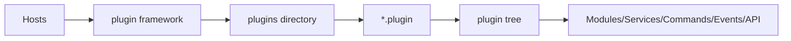

# Plugin Framework

[`Zongsoft.Plugins`](https://github.com/Zongsoft/framework/tree/main/Zongsoft.Plugins) is the core library for Zongsoft plugin-based applications. It divides an application into plugin modules that can be deployed independently, declare dependencies, and attach capabilities to extension points. Terminal programs, background services, Web applications, and rich clients share the same extension model.

## Core Concepts

* Plugin manifest: A `*.plugin` file describes assemblies, dependencies, builtins, resolvers, and extension points.
* Plugin directory: By default, the host scans the `plugins/` directory under the application directory at startup.
* Plugin tree: Extension points are organized into a tree of paths, such as `/Workbench/Data/Drivers`.
* Builtin: A buildable object on the plugin tree, created or exposed by builders such as `object`, `lazy`, and `expose`.
* Application context: The runtime context representing the application, environment, modules, services, events, and [workers](https://github.com/Zongsoft/framework/blob/main/Zongsoft.Core/src/Components/IWorker.cs).
* [Application module](https://github.com/Zongsoft/framework/blob/main/Zongsoft.Core/src/Services/IApplicationModule.cs): A business or infrastructure boundary explicitly defined and mounted by the application. It can have its own service domain and event registry; modules do not automatically correspond one-to-one with plugins.

## Relationship with Host

The host establishes the .NET Host, configuration sources, and service container. It is distinct from a business module. The plugin framework loads manifests from `plugins/`, and the plugins register business capabilities with the application.

## Loading Results

After loading plugins, the runtime contains three layers:

* Plugin collection: Records the loaded master, slave, and child plugins.
* Plugin tree: Mounts extension points, builtins, and custom objects at unified paths.
* Service container: Registers services from host and plugin assemblies in the application service container.

The default foundational plugins mount nodes such as `/Workbench`, `/Workbench/Configuration/ConnectionSettings`, and `/Workbench/Diagnostics`. Data, Web, security, and other plugins extend these nodes with drivers, filters, commands, event handlers, and services.

## Roles and Responsibilities



Focus on the capabilities a plugin provides: services, commands, Web APIs, background [workers](https://github.com/Zongsoft/framework/blob/main/Zongsoft.Core/src/Components/IWorker.cs), data drivers, or business modules. Understanding the plugin directory and deployed artifacts is usually sufficient.



Focus on how `*.plugin` files declare assemblies, dependencies, builtins, and extension points. Plugin authors need to understand plugin tree paths and builtin resolvers.



Focus on host startup, configuration loading, plugin directory locations, service registration, and diagnosis of plugin-loading failures.



## Further Reading

Before writing manifests, explore the [Plugin Design Essays](../../overview/pluginization.md#plugin-design-essays) to clarify module ownership, extension contracts, and delivery responsibilities.

<table data-view="cards">
	<thead>
		<tr>
			<th></th>
			<th></th>
			<th data-hidden data-card-target data-type="content-ref">Page</th>
		</tr>
	</thead>
	<tbody>
		<tr>
			<td><strong>Plugin Application Model</strong></td>
			<td>The relationship between hosts, application contexts, modules and services.</td>
			<td><a href="application-model.md">application-model.md</a></td>
		</tr>
		<tr>
			<td><strong>Plugin Manifests and Loading</strong></td>
			<td>plugin manifest, dependencies, extension point and loading strategy.</td>
			<td><a href="plugin-file.md">plugin-file.md</a></td>
		</tr>
		<tr>
			<td><strong>Host Integration</strong></td>
			<td>Launch plugin-based applications in the .NET Host.</td>
			<td><a href="hosting.md">hosting.md</a></td>
		</tr>
		<tr>
			<td><strong>Builtins and Services</strong></td>
			<td>builder, resolver, plugin tree paths and service discovery.</td>
			<td><a href="builtins-and-services.md">builtins-and-services.md</a></td>
		</tr>
	</tbody>
</table>

## Related Resources

* [Zongsoft.Plugins source code directory](https://github.com/Zongsoft/framework/tree/main/Zongsoft.Plugins)
* [Zongsoft.Plugins README](https://github.com/Zongsoft/framework/blob/main/Zongsoft.Plugins/README.md)
* [Zongsoft.Plugins NuGet package](https://www.nuget.org/packages/Zongsoft.Plugins)
* [framework repository](https://github.com/Zongsoft/framework)
