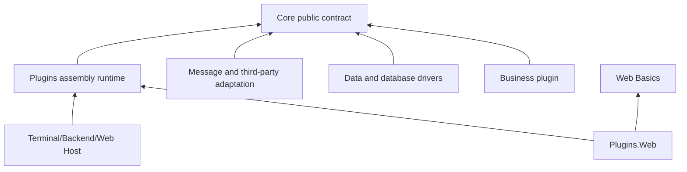
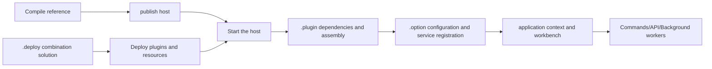

# Architecture Overview

To understand Zongsoft, you can first observe along a business request: the web host receives the request, the business plugin processes the use case, obtains the data accessor, cache or message queue through the public interface, and the specific plugin then accesses the database and external systems. The host provides the running environment, the business expresses the intention, and the implementation plugin is responsible for the technical details.

## Dependency Direction

The arrows show the main dependency direction, with some project references omitted. This differs from runtime call order: business code can use a Redis cache at runtime while referencing only the Core caching contract at compile time. [Deployment](deployment.md) and [Service Resolution](../framework/core/services.md) connect the contract to its implementation.

### Core: a Stable Common Language

[Core Library](../framework/core.md) includes public contracts such as applications and modules, services, data access, messaging, file systems, security, and configuration, as well as common implementations such as collections and conversions. Which interface the business relies on should be determined by the ability to express, not by the database or SDK to be adopted.

This does not mean that all capabilities have exactly the same semantics. For example, multiple message plugins implement the same interface, but there are still differences in message confirmation, persistence and sequence. For details, see [Message basic concepts](../framework/messaging/concepts.md).

### Plugins: Turn Declarations Into Running Objects

[Plugin Framework](../framework/plugins/README.md) reads the plugin manifest, resolves dependencies, organizes [plugin tree](concepts.md#plugin-tree), loads the declared assembly and registers the service. Builtins on the plugin tree can be created by builders or expose existing instances.

File directories organize deployment files and plugin parent-child relationships; extension paths such as `/Workbench/Modules` organize runtime objects. The two levels serve file deployment and object assembly respectively, and the ownership of the service container cannot be inferred based on the directory name.

### Function Libraries and Adapters: Realizing Replaceable Capabilities

[Data Engine](../framework/data/README.md) is responsible for mapping, query expressions and execution pipeline, and the database driver is responsible for the dialect and database client. Libraries such as [Web](../framework/web.md), [Security](../framework/security.md), and [Diagnostics](../framework/diagnostics.md) provide implementations for specific fields. [external extension](../framework/externals.md) is responsible for integrating third-party infrastructure.

The prerequisite for replacement is that both parties meet the same business semantics. After changing the driver name, you still need to verify the data type, query function, transaction and deployment dependencies; after changing the script engine, you still need to verify the script language.

## From Files to Applications

1. **Compilation** checks that code can call the target API. Debug references in the framework source may also depend on local Core build output.
2. **Deployment** copies manifests, assemblies, options, mappings, and supporting resources into a complete runtime directory.
3. **Startup** establishes the content root, configuration, and container, loads plugins, and initializes the application.
4. **Invocation** triggers the creation of some lazy services, drivers, and external connections.


💡 The presence of a plugin in the list only proves that it has been discovered or loaded. Verifying a functionality also requires checking service resolution, valid configuration, and first business invocation.


## Who Manages the Lifecycle?

The application context connects the start and stop of the host, and the workbench hosts the components that need to be run. Ordinary services and startable workers have different responsibilities: services provide operations; workers are responsible for continuous running, cancellation and closing. The constructor should try to only establish the object state and avoid putting uncontrollable external work into the assembly phase.

The module service container provides name scope and fallback rules that are not scoped per HTTP request. Shared services cannot save mutable state that is exclusive to a request, and the caller should not release shared instances obtained from the container at will. See [Modules, services and providers](concepts.md#module-service-provider) for details.

## Choose a Reading Path

- New application: from [Prerequisites](../get-started/prerequisites.md) to [Deploy Your First Plugin](../get-started/deploy-first-plugin.md).
- Develop composable services: first look at [basic concepts](concepts.md), then [Plugin Application Model](../framework/plugins/application-model.md).
- Integration database: first understand [Object Relationships and Data Access](../framework/data/concepts.md), and then complete mapping, connection and query.
- Operation and maintenance delivery: From [Deployment Model](deployment.md) to [Host deployment](../hosting/deployment.md) and [Tools](../tools/tools.md).

Source references: [Core](https://github.com/Zongsoft/framework/tree/main/Zongsoft.Core/src), [Application builder](https://github.com/Zongsoft/framework/blob/main/Zongsoft.Plugins/src/Hosting/ApplicationBuilder.cs), [Web plugin entrance](https://github.com/Zongsoft/framework/blob/main/Zongsoft.Plugins.Web/src/Application.cs).
