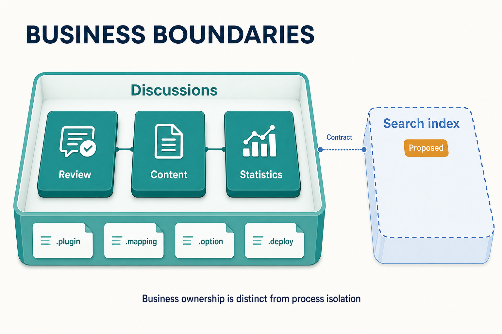

# Finding Module Boundaries Through Business Changes

Suppose the forum adds a moderation rule. One requirement typically touches thread state, content visibility, author statistics, and related queries at the same time. If the code is already split into model, service, and controller libraries, the change still crosses several directories and possibly several teams. File classification has not found a clear owner for the business.

Module boundaries should follow business change, not code function or directory position. Zongsoft's plugin architecture provides four layers of organization — application modules, assemblies, plugin manifests, and deployment files — and each layer answers exactly one question. First decide which change, which rules, and which acceptance criteria belong together, then choose the mechanism that carries them.

_Moderation, content, and statistics rules are organized by business ownership, with manifests, mappings, options, and deployment files delivered alongside the module. Search indexing is a candidate extension that needs its own agreement. The illustration expresses ownership, not database or process isolation._

## Follow a Single Change First

Approving a thread does more than set a Boolean to true. [ThreadService.Approve](https://github.com/Zongsoft/discussions/blob/main/src/Services/ThreadService.cs) combines the thread identifier, its unapproved state, and moderator eligibility into one update condition, and it also updates the approval state of the thread's content post. Moderation rules, data conditions, and permission checks live in one service; the controller only maps the result to an HTTP response.

Boundaries can be read from real business operations:

- Which data always **changes together** (a thread with its content post and statistics);
- Which rules need **one place to interpret them** (moderator eligibility, visibility, approval state);
- Which failures must be **handled together** (a thread must not half-commit when writing its content post fails);
- Which capabilities must be **released and accepted together** (one call works end to end after deployment).

Grouping by names alone is unreliable. Two types that both contain “user” do not necessarily belong to the same business: login identity, forum author statistics, and customer records are three different owners. A boundary is a boundary of change and responsibility, not of names.

## Four Layers, One Question Each

| Layer | Question it answers | Where the forum shows it |
| --- | --- | --- |
| Application module | What business identity does this capability have; how are module services resolved and where do events belong | [Module](https://github.com/Zongsoft/discussions/blob/main/src/Module.cs) defines Discussions and its accessor |
| Assembly | Which types compile together and which dependencies may be referenced | The domain library and [Discussions.Web](https://github.com/Zongsoft/discussions/tree/main/src/api) compile separately |
| Plugin manifest | Which assemblies load at runtime and where their objects attach | The domain manifest declares the module and filters; the Web manifest declares its domain dependency and delivers the controller assembly |
| Deployment | Which versions, settings, mappings, and resources are delivered | Domain and Web each describe artifact layout in a `.deploy` file |

Application modules and plugins are **not one-to-one**. A module is a business identity; a plugin is a composition unit. The forum's domain manifest mounts the module instance at `/Workbench/Modules`, while the Web manifest depends on the domain plugin and delivers its controllers with the assembly. Splitting out a Web assembly constrains protocol dependencies; it does not require a separate “Web business module.” For the naming relationship, see [Core Concepts](../concepts.md#module-service-provider) and the [Plugin Application Model](../../framework/plugins/application-model.md).


The four layers can change independently: split assemblies before splitting deployment, or let two plugins compose one module first. Introduce a layer only when the corresponding maintenance or delivery problem actually appears.


## Completeness: Own the Rules and the Delivery Resources

For a business module to work on its own, its responsibility should cover the models, services, mappings, options, and resources needed to implement its rules. Adding a field only in C# while omitting the [mapping file](https://github.com/Zongsoft/discussions/blob/main/src/Zongsoft.Discussions.mapping) and database scripts leaves a module that compiles but cannot run.

Completeness does not mean putting every file into one assembly. The forum's [domain deployment file](https://github.com/Zongsoft/discussions/blob/main/src/Zongsoft.Discussions.deploy) delivers the manifest, options, mapping, and assemblies; the [Web deployment file](https://github.com/Zongsoft/discussions/blob/main/src/api/Zongsoft.Discussions.Web.deploy) additionally delivers the Web manifest and spreadsheet templates. Both artifacts must reach the runtime directory together for the Discussions module to work. Separately published files still need compatibility; maintainers must know how the two artifacts form one usable capability.

Layering remains useful inside a boundary: services own rules, controllers adapt HTTP, and data filters shape results. With clear responsibilities, a moderation change can stay mostly in the service and its validation instead of spreading across controllers. For reuse across entry points, see [Reusing Business Capabilities Across Hosts](host-independent-business.md).

## Test a Candidate Split

Suppose the product wants an external search index. It has its own query technology and rebuild process, so it looks like a candidate for an independent plugin. Before splitting, answer these questions: what indexing delay is acceptable, how quickly must a hidden thread disappear from search, how does deletion propagate, and how does the index recover after failure?

If hiding content must take effect immediately, search results cannot rely on a stale index alone. Verify business state before returning results, or design an update mechanism that meets the timing requirement. Visibility rules still belong to the forum; the index plugin only implements search. Splitting does not automatically produce this agreement.

Conversely, if you plan to split “approve thread” and “approve thread content” into two plugins but cannot name distinct usage scenarios, failure handling, and release cadence for each, the added coordination cost usually outweighs the benefit. Keep internal type separation first, and introduce a composition boundary only when independent delivery is actually needed.


A module service container provides a name-resolution domain, not a security boundary. Code in the same process can still reference another module's implementation or access its database. Tenant isolation, data authorization, and process isolation need their own design; see [Design Principles](../conception.md).


## Reinforce Boundaries with Engineering Constraints

Module containers help organize service lookup, but they cannot force a team to collaborate only through public contracts. If several modules really must evolve independently, also enforce project-reference review, interface review, and contract tests. The Core library is the place for general framework contracts; product-specific cross-module contracts should have an explicit product owner instead of accumulating in an ever-growing shared library.


Boundaries can change as understanding improves. An application with few rules, focused changes, and a short maintenance horizon may be better off with a simple structure. Introduce boundaries when repeated co-change, multi-person collaboration, or independent delivery creates a real need. When reviewing a candidate module, state the rules it owns, the entry points it exposes, its behavior when dependencies are missing, and which artifacts must be validated together when replacing it.


## Further Reading

- Continue from a business operation to [reusing business capabilities across hosts](host-independent-business.md).
- Elux's [micro-module design](https://github.com/hiisea/elux/blob/main/docs/designed/micro-module.md) and its author's exploration of [frontend business modularization](https://www.cnblogs.com/hiisea/p/16624472.html) (in Chinese) approach organizing code and resources around business capabilities; this article develops the idea through Zongsoft's server-side modules, composition, and delivery, whose runtimes should be understood separately.
- The naming boundary between modules, services, and providers: [Core Concepts](../concepts.md#module-service-provider).
- Application modules and plugin composition: [Plugin Application Model](../../framework/plugins/application-model.md).
