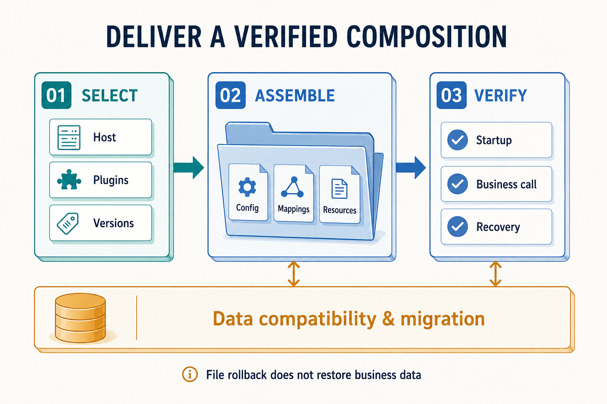

# From Incremental Change to Verified Plugin Delivery

A business system in production rarely gets to pause all requirements for a full redesign. Introducing Zongsoft plugins works the same way: instead of moving all code into the new structure at once, pick one business path with clear responsibility, verify its services, composition, and deployment, then widen the scope step by step. Each step should leave a version that runs, can be observed, and has a known response when something fails.

## Fix a Baseline First, Then Choose the Slice

Before restructuring, fix what is observable: given inputs, which outputs come back; which identities may call; how exceptions behave; and roughly what resources are consumed. Compare every later step with this baseline to detect that structure changes quietly altered the business.

A good first slice has these characteristics:

- explicit input and output with a traceable call chain;
- reasonably clear data ownership and dependencies;
- independent acceptance — verifiable without the whole environment;
- a side-effect-free or controllable path when possible.

The forum's user export is a useful reference: its [template model provider](https://github.com/Zongsoft/discussions/blob/main/src/Features/Archiving/UserDataTemplateModelProvider.cs) obtains data through the user service. To reshape a similar capability, keep the call entry and business rules first, organize template adaptation and resource delivery as a plugin, then validate results, filter scope, and permissions. Being “read-only” does not exempt export from data-scope constraints.

## Leave a Runnable Result at Every Step

| Stage | Main change | Evidence to move on |
| --- | --- | --- |
| Extract a business entry | The original entry calls a service with clear responsibility | Original results, permissions, and failure behavior remain verifiable |
| Declare plugin composition | Add manifest, dependencies, and required extensions | The target host loads the plugin and resolves its services |
| Fix delivery artifacts | Write deployment rules that collect configuration and resources | A clean runtime directory completes one real call |
| Switch the call path | The new implementation takes over a defined scope | Errors, latency, and differences between old and new results are observable |
| Retire the old implementation | Remove duplicate entries and obsolete dependencies | Callers have migrated and runtime records show the old path is unused |

“Switching” is a release decision and may use application routing, configuration, or deployment batches; it does not mean the framework replaces loaded assemblies online. If you must compare old and new implementations in parallel, start with side-effect-free reads whose results can be compared. Do not run both versions of a write merely to compare outcomes: duplicate notifications, duplicate deductions, or duplicate file creation can produce business effects that rolling back an assembly cannot undo.

## Treat the Release Combination as the Object Under Test

_After host and plugin versions are chosen, deliver configuration, mappings, and resources, then verify startup, business calls, and recovery. Data compatibility and migration need their own design; file rollback is not a substitute._

The forum's [domain deployment file](https://github.com/Zongsoft/discussions/blob/main/src/Zongsoft.Discussions.deploy) covers the manifest, options, mapping, and assembly rules; its [Web deployment file](https://github.com/Zongsoft/discussions/blob/main/src/api/Zongsoft.Discussions.Web.deploy) adds the Web manifest and templates. A usable delivery unit must carry the metadata and resources the runtime depends on — not just DLLs.

For a product with several customer configurations, record the host, plugin versions, drivers, configuration requirements, and migration steps of every supported combination. Release validation should at least cover the smallest real combination and key extension combinations, and it should distinguish a missing optional plugin from a missing required one. There is no need to claim every theoretical permutation as a product capability.

Releasing a plugin package independently means it can be produced and managed on its own; whether that version can go live still depends on compatible hosts, shared dependencies, extension contracts, and data structures. Shared-assembly version conflicts inside one process cannot be solved by renaming plugin directories.

## Data Changes Define the Recovery Boundary

When a plugin rollback only replaces program files, the database and external files may already have changed. Before release, answer whether the old version can ignore a newly added mapping field, can still read a converted storage format, and can tolerate external notifications the new version already sent.

Follow the pattern that fits: add a compatible field first, migrate data gradually, switch reads and writes, then remove the old structure last. For data changes that cannot stay compatible with the old version, state the recovery plan and maintenance window explicitly. Deployment tools deliver artifacts; they do not derive data migrations or business compensation for the application. For the division of labor, see the [Deployment Model](../deployment.md) and [Upgrade Integration and Recovery](../../framework/upgrading/workflow.md).

## When Is a Separate Process Worth It

Plugins organize code and runtime composition; a process split adds new failure and communication boundaries. The two can be combined as needed:

| Need that appears | Option to evaluate first | Extra cost or limitation |
| --- | --- | --- |
| Different products select different capabilities | Combine plugins through deployment configurations | Manage the supported version combinations |
| Several entry points share business rules | Separate business services from host adapters | Identity, configuration, and runtime dependencies must still be supplied |
| A workload needs independent scaling or fault isolation | Run the capability in a separate host process | Add protocols, timeouts, observability, and recovery |
| Untrusted extensions need permission isolation | Build a security boundary in deployment and runtime infrastructure | In-process plugins cannot provide that guarantee |

Moving a local call onto a network changes failure semantics: when a request times out, the remote side may already have completed the write. Idempotency, retries, data ownership, and result queries need a new agreement; replacing an interface implementation with a remote client is not enough. A separate process should not be a mandatory destination for every plugin.

## Judge the Design Through a Release

After the first slice, check whether the next requirement stays mostly within its own business scope, whether the runtime directory can be assembled repeatedly, whether failures can be located at a service call or a composition stage, and whether the delivery owner can explain the recovery steps. These outcomes say more than the number of new projects.

If ownership is still unclear, return to [Finding Module Boundaries Through Business Changes](business-boundaries.md); for inter-module agreements, see [Designing Extension Points as Collaboration Contracts](extension-contracts.md). Hands-on paths start with [Write Your First Business Plugin](../../get-started/first-business-plugin.md) and [Deploy Your First Plugin](../../get-started/deploy-first-plugin.md).

## Further Reading

- The Elux author's article on [decomposing large frontend applications](https://www.cnblogs.com/hiisea/p/16914890.html) (in Chinese) discusses progressive restructuring through layering and slicing large applications; this article develops the server-side plugin evolution for Zongsoft. Frontend module loading is not an upgrade guarantee for plugins.
- Deployment model: [Deployment Model](../deployment.md); host delivery: [Deploy a Host](../../hosting/deployment.md).
- Layered troubleshooting of runtime problems: [Run and Debug](../../get-started/run-and-debug.md).
