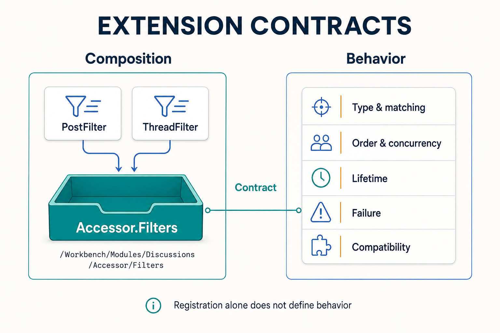

# Designing Extension Points as Collaboration Contracts

Loading a plugin establishes that it has entered the runtime environment. Letting another team extend it also requires an agreement about where objects belong, which interfaces they implement, when they run, and who handles failure. An extension point is useful when these agreements let both parties work independently.

Zongsoft's plugin tree makes composition locations explicit, and its service container provides capability lookup. Designers still need to define the business semantics around these mechanisms. This article starts with actual forum filter registration to explain how to maintain a contract other plugins can use.

_The left side shows actual forum filter registration, with the path wrapped across two lines. The right side lists design responsibilities rather than five existing manifest settings._

## Identify Both Sides of an Existing Extension Point

The forum's [Zongsoft.Discussions.plugin](https://github.com/Zongsoft/discussions/blob/main/src/Zongsoft.Discussions.plugin) references the existing module instance beneath `/Workbench/Modules` and exposes the accessor's filter collection. It then contributes two filters at `/Workbench/Modules/Discussions/Accessor/Filters`.

The module provides an extensible collection, while the filters supply objects that meet its requirements. In the manifest, `expose` connects existing members; the `type` on an `object` describes an instance to construct. See the XML in [Plugin Files and Loading](../../framework/plugins/plugin-file.md).

The path is only part of the contract. Existing filters also match models, so successful registration does not mean every query runs every filter. An external plugin contributing to this collection needs to understand matching conditions, processing stages, and object lifetimes instead of merely copying a path string.

## Choose Collaboration by Its Completion Requirements

| Need | Possible mechanism | Agreement to define |
| --- | --- | --- |
| The caller needs the outcome of this operation | Call a service through an explicit contract | Input, results, permissions, timeouts, and failures |
| The capability owner lets others contribute processing | Register a filter, handler, or driver at an extension point | Applicability, ordering, shared state, and exceptions |
| Several interested parties should learn about a fact | Define an event and its handling | Publication timing, payload, and subscriber-failure impact |
| Work must cross processes or survive delivery failures | Use messaging with an appropriate persistence strategy | Acknowledgment, retry, duplicate handling, and recovery ownership |

These mechanisms can be combined: a service completes an operation, then arranges an external index update after commit. A step required for transaction success should not become an untracked notification merely to reduce coupling. Events reduce references to concrete subscribers while moving some dependencies into event semantics and operational diagnosis.


The forum's current [EventRegistry](https://github.com/Zongsoft/discussions/blob/main/src/Module.cs) does not define concrete business events. Exposing `Events` in its manifest does not mean posting or approval publishes events, much less delivers them reliably to a message broker. Such capabilities still need a complete implementation. See [Events](../../framework/core/components/events.md).


## Write an Extension Point's Usage Agreement

Suppose a product plans to let third parties add post-approval indexing handlers. Review at least the following information. This is a design proposal, not an existing forum extension API.

- **Owner and entry point:** Who maintains the extension point, which plugin contributors depend on, and which contract its collection accepts.
- **Input and applicability:** Whether input contains committed business identifiers or mutable objects, how sites are identified, and which operations trigger processing.
- **Ordering and concurrency:** Whether handlers have a defined order, run concurrently, or may be called repeatedly. File order should not be treated as a business-ordering guarantee.
- **Failure and lifecycle:** Whether exceptions affect the main operation, who records and retries failures, and whether shutdown waits for in-flight work.
- **Compatibility and validation:** How new fields are handled, whether old plugins remain usable, and whether the business works without any contributed handler.

Exposing more mutable objects makes it easier for consumers to depend on internals. For a long-lived extension, provide input and output suited to its purpose. Avoid turning the entire service container, data accessor, and internal object graph into a public protocol just for convenience.

## Review Plugin Dependencies and Project References Together

The forum's [Web manifest](https://github.com/Zongsoft/discussions/blob/main/src/api/Zongsoft.Discussions.Web.plugin) depends on its domain plugin. Assembly references make types available at compilation, manifest dependencies describe runtime composition requirements, and deployment delivers the files. All three should match the actual call relationships. A dependency name does not download a NuGet package automatically.

If two business plugins reference each other's internal services and wait for each other's objects during startup, reconsider responsibility for their collaboration. A stable public contract or a higher-level component owning the complete workflow may help. Dependencies that require immediate results should remain explicit; replacing them with string-based service names does not remove them.

See [Plugin Application Model](../../framework/plugins/application-model.md) for module-first lookup and shared-service fallback. Lookup helps select an implementation, but a consumer still needs to know which capability it requires, where the implementation comes from, and what happens if it is unavailable.

## Make Names Traceable Without Confusing Their Domains

A failure record containing only `Discussions` may leave readers unsure whether it identifies a module, a plugin, or connection configuration. Document both the category of a name and its scope rather than expecting a team to infer relationships from identical strings.

The forum provides a concrete example: the Web plugin is named `Zongsoft.Discussions.Web` and depends on the `Zongsoft.Discussions` plugin; the business module is named `Discussions`; `PostFilter` names a builtin beneath the accessor's filter collection. These names participate in plugin dependencies, module lookup, and tree-node resolution respectively. They are not interchangeable. Document ownership and scope when adding public paths or service aliases, and maintain names used by existing consumers.

## Verify Business Effects as Well as Composition

Test cases where the plugin loads but its extension does not behave as expected: model mismatches, duplicate registration, missing target nodes, handler exceptions, ordering changes, and concurrent calls to a shared instance. Checking that a type can be constructed misses these collaboration failures.

For extensions requiring reliable notification, also examine the failure window between database commit and message publication. Depending on consistency requirements, the application might need persisted pending messages, compensation, or reconciliation. These are application designs, not automatic consequences of framework event support. See [Message Delivery Concepts](../../framework/messaging/concepts.md).

Clear contracts let maintainers assess compatibility, determine whether a missing optional plugin permits startup, and assign ownership when something fails. The next article tests these agreements through [Incremental Change and Delivery](evolutionary-delivery.md).

## Further Reading

Elux's [Micro Module Design](https://github.com/hiisea/elux/blob/main/docs/designed/micro-module.md) provides background on module collaboration, while the author's [namespace article](https://www.cnblogs.com/hiisea/p/16645688.html) prompted consideration of traceable names. Both are in Chinese. This article concerns Zongsoft's plugin tree, service resolution, and server-side failure handling. Its extension paths and runtime behavior come from the linked Zongsoft implementation.
