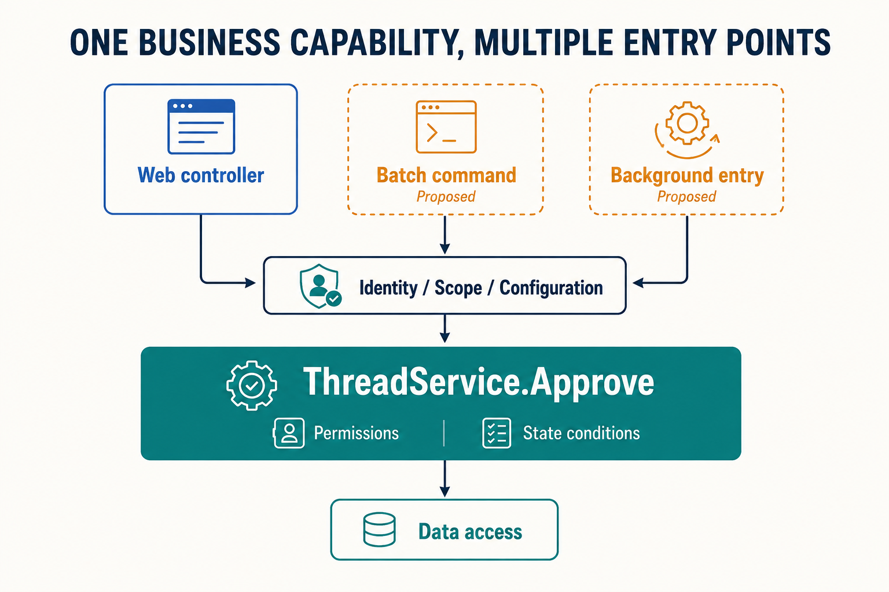

# Reusing Business Capabilities Across Hosts

A forum initially allows moderators to approve threads through a Web interface. Operations later needs batch processing of historical threads, and a partner system needs access to the moderation workflow. The valuable reusable capability is an operation with defined conditions and results. Each new entry point should preserve its rules while owning its own input and output.

Zongsoft separates hosting, plugin composition, and business services to support this reuse. Moving a service out of a controller still leaves identity, data access, and lifecycle dependencies that the new entry point must supply.

## Read Responsibilities from a Real Call

The existing [ThreadController](https://github.com/Zongsoft/discussions/blob/main/src/api/Controllers/ThreadController.cs) approval action calls [ThreadService.Approve](https://github.com/Zongsoft/discussions/blob/main/src/Services/ThreadService.cs) and maps the Boolean result to HTTP 204 or 404. The service combines thread-state and moderator-eligibility conditions; the controller owns routing and protocol responses. See [Requests and Data Service APIs](../../framework/web/data-services.md).

This separation provides a reusable business entry point with a result contract that needs care: false means no matching update occurred. It does not directly distinguish a missing thread, an already approved thread, or insufficient eligibility. If a new command needs more precise feedback, consider extending the business result contract, including the limits on disclosing permission-sensitive information. The command should not invent a failure reason.

## Make the Dependency Direction Support Reuse

The diagram shows a possible call structure. Web moderation already exists; the batch command and background moderation entry are proposed examples of reuse, not existing forum features.

_Each entry point supplies identity, business scope, and configuration before calling the approval service. The middle bar represents shared design responsibilities, not an additional framework gateway. Dashed entries are proposals._

Each entry point converts external input into a business call and handles its own output format. The domain service should not call a controller to produce a response or require a terminal to simulate an HTTP request. Project references should follow the same direction: [Discussions.Web](https://github.com/Zongsoft/discussions/tree/main/src/api) adapts domain capabilities, while the domain assembly retains its own dependency boundary.

Layering does not require an interface around every method. The current forum controller uses a concrete data service. Introduce an interface and assign its ownership when cross-module consumers need a stable contract or multiple implementations need substitution. Clear responsibility and avoiding pointless forwarding layers both help maintainability.

## Carry the Required Context Across the Boundary

At the Web entry point, the application has already established authentication and a request environment. A command or background entry does not acquire these conditions automatically. Moderation eligibility depends on the caller; running in the background does not imply moderator privileges.

| Requirement | Source in a Web entry point | Responsibility of a new entry point |
| --- | --- | --- |
| Caller identity | Authentication and authorization | Establish a trusted execution identity and appropriate permissions |
| Business scope | Request parameters and service constraints | Specify the site, target resources, and permitted scope |
| Configuration and services | Plugin host composition | Deploy domain dependencies, configure connections, and verify resolution |
| Completion and failure | HTTP response | Define command results, task records, and failure handling |
| Interruption and retries | Request lifecycle | Use supported cancellation mechanisms and verify repeated-operation semantics |

These are design responsibilities, not a claim that every current method accepts a common context object or cancellation token. Use the existing API to pass parameters or establish an execution context explicitly. Include compatibility considerations when extending a contract.

## Separate Call State from Component Lifecycles

A continuously listening message entry point can use a [worker](https://github.com/Zongsoft/framework/blob/main/Zongsoft.Core/src/Components/IWorker.cs) for startup and shutdown, calling the service for each message. An [initializer](https://github.com/Zongsoft/framework/blob/main/Zongsoft.Core/src/Services/IApplicationInitializer.cs) supports composition during application initialization. A [workbench](https://github.com/Zongsoft/framework/blob/main/Zongsoft.Plugins/src/IWorkbenchBase.cs) helps organize running components within the host. These address distinct phases. Starting a long-running task in a service constructor does not replace lifecycle management.

Shared services should not retain the thread identifier or caller identity for “this approval.” Services can serve multiple callers; call data should remain within an explicit execution scope. A module provider is not a Web-request scope. See [Service Resolution and Ownership](../../framework/core/services/locating.md).

## Store State According to Its Lifetime

“Moderation state” might mean selected threads in a user interface, completed items in a batch, or committed approval results in the database. These belong to interaction, task-execution, and persistent-business lifetimes respectively. They should not all be stored in a shared module instance.

For example, a proposed batch moderation entry that must resume after interruption could use persistent task records for progress, rechecking permissions and target state on recovery. Progress held only in worker fields disappears when the process exits. Restoring a memory snapshot cannot undo committed approvals. Module boundaries establish ownership of rules; storage decisions still depend on recovery requirements.

## Verify Reuse at Two Levels

First verify business outcomes: an ineligible caller is rejected, repeated approval follows the contract, and the content-post approval state stays consistent. Given the necessary configuration, identity, and data dependencies, these checks should be able to call the service without starting the complete HTTP pipeline solely to test business rules.

Then verify the entry point: how a controller maps results, how a command establishes identity, and how a background task recovers after interruption. Entry points can share the first group of checks while retaining their own adapter checks. This makes it possible to distinguish changes to business rules from changes to how those rules are accessed.

HTTP entry points should follow the [REST API Design Guidelines](https://github.com/Zongsoft/Guidelines/blob/main/zongsoft.rest-api.guidelines.md), and C# implementations should follow the [C# Coding Guidelines](https://github.com/Zongsoft/Guidelines/blob/main/zongsoft.csharp.guidelines.md), both in Chinese. Continue with [Extension Contracts](extension-contracts.md) to decide whether a new capability belongs behind a service call, an extension collection, or an event.

## Further Reading

Elux's [Model-Driven Design](https://github.com/hiisea/elux/blob/main/docs/designed/model-driven.md) and [Layered Design](https://github.com/hiisea/elux/blob/main/docs/designed/three-layered.md) discuss business logic and interaction entry points. The author's [state management](https://www.cnblogs.com/hiisea/p/16695692.html) and [virtual window](https://www.cnblogs.com/hiisea/p/16638875.html) articles also prompted consideration of state lifetimes. These references are in Chinese. This article examines server-side identity, transactions, and host lifecycles. Frontend state models do not map directly onto Zongsoft data-model APIs.
