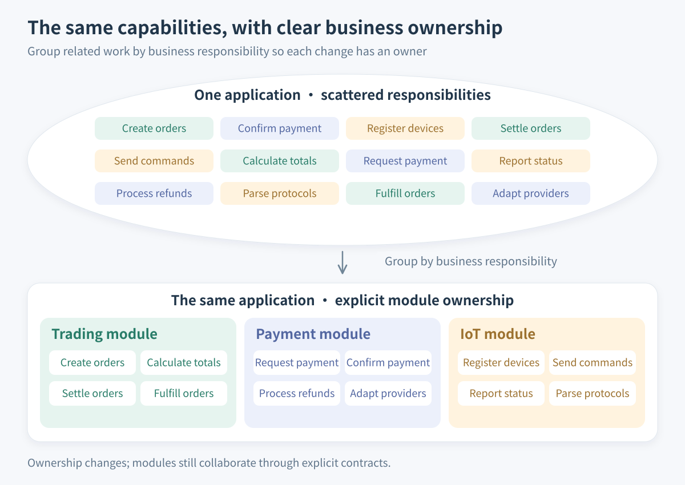
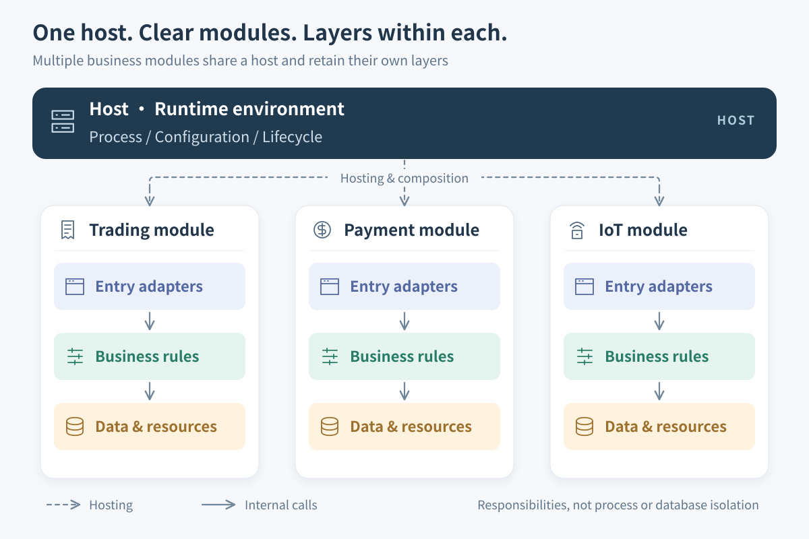
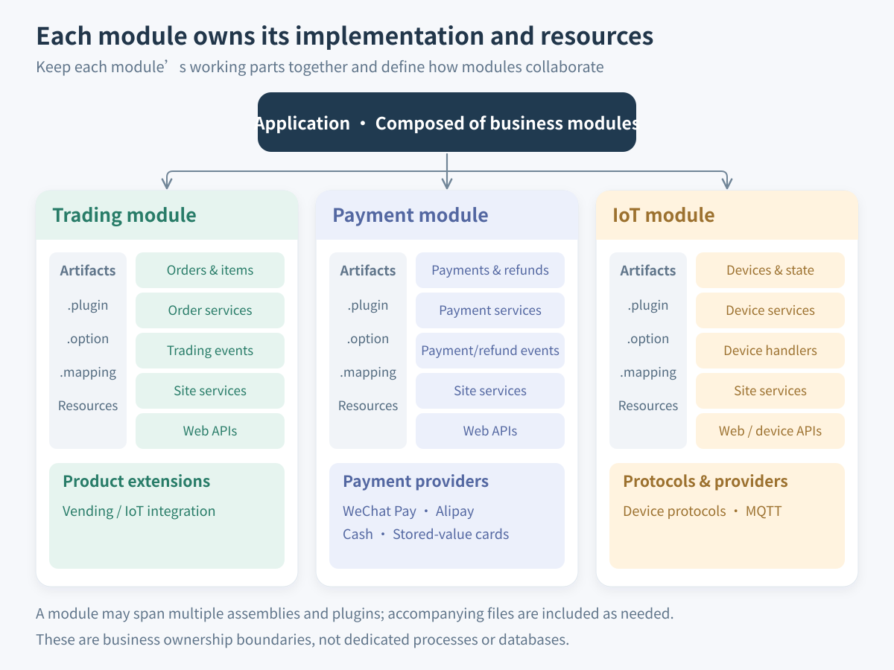
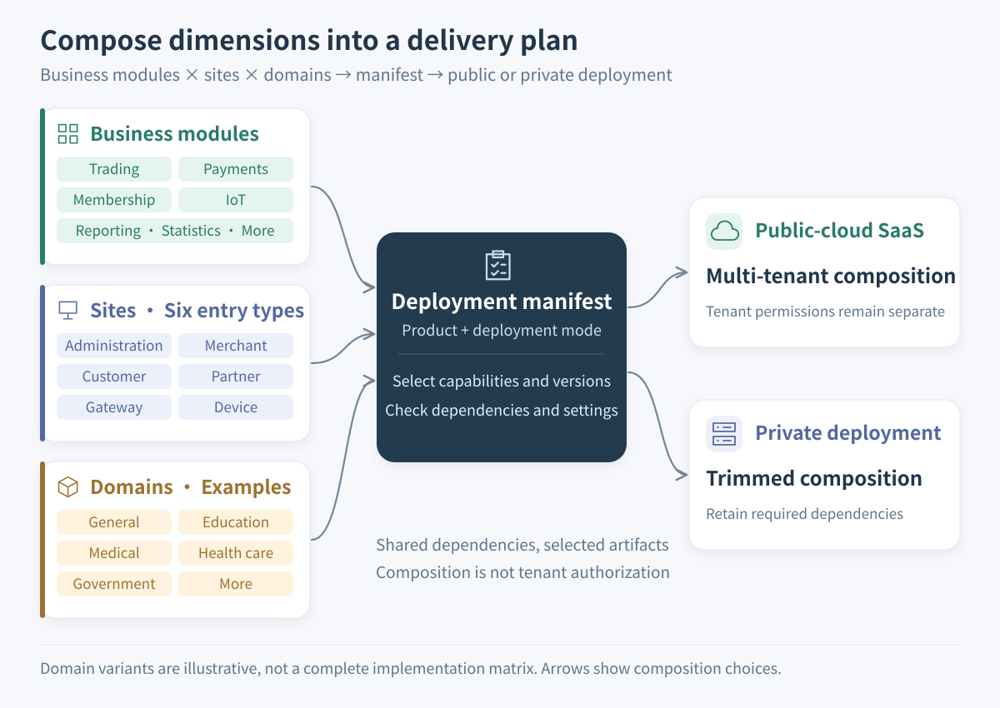
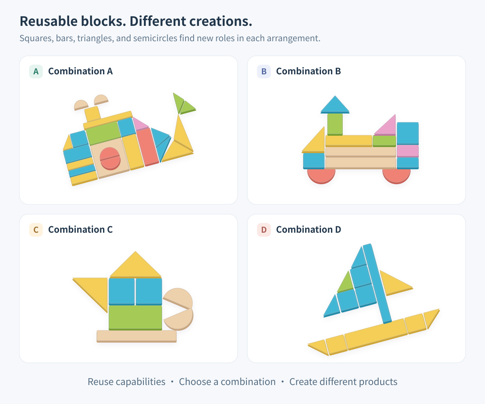

# Why Pluginize

A customer scans a code, pays, and takes an item from a machine. To the customer, this is one action: buying something. The system has many more questions to answer. Which merchant owns the order? Which payment method applies? Can the external notification be trusted? Payment succeeded but the device did not respond: is it safe to resend the dispense command? If only some items were dispensed, how much should be refunded? After an operator intervenes, may a late device message still change the order?

This is just the vending scenario in **Automao**, a commercial SaaS system that supports both public and private deployment. It also includes trading, payments, membership, IoT, ticketing, marketing, reporting, statistics, and surveying modules. Payment methods include external platforms such as WeChat Pay and Alipay, as well as cash and stored-value cards. Different entry points serve platform administrators, merchant staff, customers, or devices.

Complex business requirements are manageable. The harder problem is **having to understand half the system whenever you add a payment method, a product variant, or an entry point**. Pluginization addresses how to give these changes clear owners and compose existing capabilities into new combinations.


This architectural case draws on Automao's module directories, plugin manifests, handlers, and workflow documentation. Automao is a closed-source commercial system; this article provides no external links to it, source excerpts, or production configuration. Hypothetical requirements and illustrated combinations are not claims about shipped product editions.


## If It Were a Monolith: A Maintenance Nightmare

Imagine putting these capabilities into an application with no clear business boundaries. All models go into `Models/`, all services into `Services/`, and all controllers into `Controllers/`. Any code may call the shared utilities or update a business table. Files are neatly sorted by technical role, but the essential question remains unanswered: **who owns this rule?**

At first, this is convenient. A payment callback updates the order and sends a device command. When points are needed, someone adds a membership call. Each small change delivers its feature. Years later, the callback has become the central switch for orders, devices, membership, and marketing.

### Change One Thing, Inspect Half the System

Now a new payment channel is needed. A developer finds code that updates payment status but hesitates to reuse it. Does it also change the order? Does it assume a particular provider's voucher format? Does it trigger dispensing? Could a duplicate notification dispense the goods twice?

The expensive part is discovering these hidden assumptions every time, rather than writing a few adapter methods. The regression scope grows too: a channel change may require checking the entire purchase journey.

### Refactor Locally, but Find Nothing You Can Remove

The payment implementation needs replacing, but order services reference its internal types, reports read its intermediate states, and device callbacks bypass its services to update its data. Refactoring “just payments” now requires every consumer to coordinate.

The business cannot pause for a large rewrite, so developers keep adding branches to the old structure. The harder it becomes to change, the less anyone changes it; the next change then requires understanding still more history. This is how a maintenance nightmare develops.

### The Customer Wants a Subset but Receives Everything

Suppose a private-deployment customer needs basic trading and a specified payment method, with neither marketing nor device integration. If the purchase flow calls these capabilities directly, hiding their menus does not make them optional dependencies. Remove a package and startup may fail. Keep everything and someone must maintain configuration and dependencies the customer never uses.

Add differences in merchant and customer permissions, product customization, and external platforms, and scattered conditionals become increasingly hard to inventory. Copying the application may deliver a customer edition today, but the next shared bug fix must be synchronized across those copies.



_Figure 1: Above, capabilities are scattered. Below, the same capabilities belong to trading, payment, and IoT modules. No capabilities have been removed or processes separated; ownership and collaboration boundaries have changed. Adapted from [Hiisea’s business-grouping figure (micro-module.png)](https://www.cnblogs.com/hiisea/p/16624472.html), replacing abstract feature identifiers with this article’s business responsibilities._


The problem discussed here is an application whose unclear boundaries make changes interfere with one another. **A monolith describes deployment; modularity describes internal structure.** A monolith can have sound module boundaries, and multiple services can remain tightly coupled. Directories such as `Models/` are useful; trouble arises when technical roles are the application's only organizing principle.


## Cut Horizontally First: Layered Order

Hiisea's [cake-slicing article](https://www.cnblogs.com/hiisea/p/16914890.html) uses horizontal and vertical cuts to explain complementary ways to divide an application. On the server, first identify three kinds of responsibility: entry adapters, business rules, and data access and resources.

Entry adapters interpret external requests, business rules decide what may happen, and data access stores and retrieves the results. Receiving a payment notification and deciding whether a payment may move from processing to success are different responsibilities, even when they execute in sequence.

Automao's payment integration shows this separation. External-platform integration and payment providers handle platform differences and pass results to the payment module. That module declares payment and refund events. A trading background plugin registers its own handler for payment-success events and performs subsequent order processing. Each payment channel therefore need not reimplement order progression.

The aim is to separate **changes caused by different things**. A provider's notification-format change usually belongs in its adapter; a settlement-rule change belongs in the trading service or handler. Business rules also change frequently. Layering does not assume they are permanently stable; it keeps a protocol change from requiring an unrelated business rewrite.



_Figure 2: The host carries trading, payment, and IoT modules; each retains entry adapters, business rules, and data and resources. Dashed arrows indicate hosting and composition; solid arrows show internal calls. These are not process or database isolation boundaries._

## Cut Vertically Next: Business Modules

Layers alone are insufficient. If order, refund, membership, and device rules still occupy one large business library, developers know which layer to search but still cannot readily maintain payments as a complete capability.

A vertical cut asks: **which rules, data, and resources should be owned together around a business responsibility?** Payments owns the meaning of payments and refunds; trading owns orders and fulfillment; IoT owns device integration and communication. Each module can remain layered internally while collaborating through explicit service contracts, events, or extension points.

Hiisea's [micro-module concept](https://www.cnblogs.com/hiisea/p/16624472.html) groups a business area's code and resources together. Completeness is the useful idea, rather than making “micro” mean as few files as possible. A handful of extracted business classes remains difficult to maintain independently if their mappings, settings, and entry adapters belong elsewhere.

### From Business Modules to Plugin Composition

In Zongsoft, plugins make this division explicit in runtime composition. A `.plugin` manifest declares dependencies, assemblies, and extension contributions. Assemblies provide implementations, accompanied where needed by `.option` settings, `.mapping` files, and resources. Not every plugin needs every kind of file, or an assembly of its own.

Automao's payment module has three recognizable groups of collaborating artifacts:

- **Foundation**: payment and refund models, service base classes, module definitions, events, and related mappings and settings.
- **Site implementations**: services and Web adapters for administration, merchant, and customer entry points, with their authorization, validation, and mutability requirements.
- **Payment providers**: implementations for WeChat Pay, Alipay, cash, and stored-value cards. The WeChat provider depends on the payment foundation and WeChat integration; a gateway manifest additionally contributes payment and refund callback handlers.



_Figure 3: Each module owns its business implementation and accompanying files. The payment module in the middle includes payment/refund models, services, events, site adapters, and providers, matching the three artifact groups above. A module may span multiple assemblies and plugins; the illustrated files are not mandatory for every plugin. Adapted from [Hiisea’s complete-module figure (micro-domain.png)](https://www.cnblogs.com/hiisea/p/16624472.html), replacing frontend responsibilities with Zongsoft server-side organization._

One payment business module can therefore involve foundation, site-service, Web, provider, and background plugins. See [Core Concepts](../concepts.md#module-service-provider) for the distinction between application modules, assemblies, and plugins.

Adding a channel should usually start with its provider implementation, configuration, dependencies, and deployment entries. If the existing contract cannot express its business semantics, the shared contract also needs coordinated changes. Removing a channel requires checking dependents and handling outstanding payments and refunds; deleting a file alone is insufficient.

### How a Transaction Completes After the Split

Return to “paid, but not yet dispensed.” Payments establishes the state of the money. Trading decides whether the order may advance and organizes fulfillment. Device integration sends commands and handles device reports. Vending extensions connect these general capabilities into the product's workflow. Payment events, trading handlers, and vending/IoT extension directories provide concrete implementation points for this division.

The business chain remains connected, with an owner for each part. When a device command needs retrying, the discussion can start at the boundary between communication and fulfillment, instead of giving every payment provider its own dispensing-retry logic. A proposed membership reward also needs an explicit choice of business event: successful payment does not automatically mean the purchase is finally complete.


Events let participants avoid direct dependencies on each other's implementations, but do not automatically provide reliable delivery, idempotency, or cross-module transaction consistency. Duplicate notifications, partial dispensing, refund compensation, and operator intervention still need explicit design. See [Reliable Delivery and Message Storage](../../framework/messaging/reliability.md) and [Transactions and Consistency](../../framework/data/transactions.md).


## Multiple Dimensions Become Composable

A single payment capability raises several different questions: which business module owns it, who uses it, which provider does it integrate with, which product includes it, and where does it run? Put every answer into conditional branches inside a payment service, and that service gradually becomes responsible for composing the entire product.

Automao's organization offers another way to examine these dimensions:

| Dimension | Existing organization or scenario | Main question |
| --- | --- | --- |
| Business | Trading, payments, membership, IoT, ticketing, and other modules | Who owns the rules, data, and behavior? |
| Domain and site | Site implementations under `domain/default`, alongside sites in common and product directories | Which rules are shared, and which authorization and entry behaviors differ? |
| Provider and protocol | Payment providers, device protocols, and external integrations | How are external-system differences adapted? |
| Product | Vending common, payment, trading, IoT, and cross-module extensions | Which capabilities are composed, and which workflows belong to the product? |
| Deployment | Hosts, environments, and public or private deployment requirements | Which artifacts, settings, and infrastructure are actually delivered? |

These dimensions can be organized separately, but **every combination must satisfy its dependencies**. Arbitrary combinations are not guaranteed to work, nor does this structure imply that every module implements every domain and site variant.

For example, a vending delivery might require trading, payments, membership, IoT, and reporting, plus its own workflow extensions. A private deployment might omit optional capabilities and select a specified payment provider, where the business permits. Shared rules remain reusable; differences mainly belong in extensions, settings, and delivery manifests. Customer customization need not begin by copying the entire business implementation.



_Figure 4: Business modules, sites, and domains feed a deployment manifest for public or private deployment. Sites include administration, merchant, customer, partner, gateway, and device entry points. Education, medical, and other domains are illustrative candidates, not claims that every module implements them. Combinations must satisfy dependencies; tenant authorization is designed separately._

Two kinds of manifest matter here: **deployment manifests select what goes into the runtime directory; plugin manifests describe how those artifacts join the application**. A `.deploy` file is not tenant feature authorization, and a `.plugin` dependency declaration does not download a package. See the [Deployment Tool](../../tools/deployer.md) and [Plugin Manifests and Loading](../../framework/plugins/plugin-file.md).

Deciding which capabilities a SaaS tenant may use still requires tenant configuration and authorization rules. Private deployments still require suitable data, infrastructure, and operational arrangements. Pluginization supplies a basis for composition alongside those designs.

Building blocks make this reuse tangible: squares, bars, triangles, and semicircles keep their individual shapes while forming different creations. Business modules work similarly. Trading, payments, and membership can serve different products, each adding its own workflows and extensions. **Modules supply reusable capabilities; selection, composition, and extension express the differences between products.**



_Figure 5: The same types of basic blocks form different combinations. Redrawn from the [building-block illustration referenced in Hiisea's article](https://www.cnblogs.com/hiisea/p/16624472.html). This is an analogy for reuse through composition; software modules must still respect contracts and dependencies._

## Turn the Directory Structure Around

When business ownership is the first organizing principle, directories should help developers find the business responsibility before its technical implementation. These examples omit unrelated files. The second is simplified from the case's current structure, not a complete deployment template.


```text
src/
	Models/       # Models from every business area
	Services/     # Services from every business area
	Controllers/  # Controllers from every business area
	Mappings/     # Mappings from every business area
```



```text
modules/
	trading/
		abstraction/src/         # Models, service bases, events, mappings, plugins
		domain/default/sites/    # Site services in src, entry adapters in api
	paying/
		abstraction/src/
		domain/default/sites/
		providers/               # WeChat Pay, Alipay, cash, stored-value cards
	things/
		abstraction/
		protocols/               # Device protocols
		providers/               # IoT providers
products/
	vending/
		common/                  # Shared vending capabilities
		paying/extensions/things/  # Product payment/IoT integration
		trading/extensions/things/ # Product trading/IoT integration
		things/                  # Vending device capabilities
hosting/                         # Runtime, startup, configuration, plugin loading
```


Payment models and mappings are different file types but share business ownership. Device protocols have an explicit home. Product-specific collaboration belongs in the product directories. Technical directories such as `Models/` and `Services/` can remain inside each module.

Moving files only makes an intended boundary visible. **If trading still modifies payment internals freely, moving directories has not decoupled the modules.** Project references, public contracts, data-access agreements, and reviews must reinforce the boundary. Cross-module code should not simply accumulate in a new, ever-growing “common module.”

## What Pluginization Changes

The most useful measure is the next business change: can the team find its owner faster, assess its effects more accurately, and deliver it with greater confidence?

| Change | Without clear boundaries | With module and composition boundaries |
| --- | --- | --- |
| Diagnosing problems | Trace payment failures across a global call chain | Distinguish provider, payment state, and order integration, then locate the responsible artifacts |
| Incremental refactoring | Internal details have many consumers that must change together | Preserve the public contract and replace one provider or module implementation first |
| Product composition | Hidden menus still bring the entire dependency set | Select capabilities with their dependencies and record delivered versions and settings |
| Reuse across entry points | Merchant and customer implementations duplicate shared rules | Share foundational rules while retaining site-specific permissions and behavior |
| Delivery verification | Code compiles, but mappings, settings, or handlers are missing | Verify code and related metadata as one delivery combination |
| Team collaboration | Many teams are involved but none owns acceptance | Modules have owners, and cross-module changes have explicit contract participants |

With an unchanged provider contract, for instance, a team can refactor one payment channel and then verify its integration with payment services, the gateway, and trading. Necessary collaborators remain in scope, without requiring a membership or reporting rewrite. **Being able to improve the system piece by piece while business development continues** matters more than predicting every requirement at the start.


Plugins can be developed and packaged separately without being independently releasable, independently reversible, or replaceable without downtime. Plugins in the same host usually share process resources; assembly versions, public contracts, data structures, and runtime state constrain upgrades. Plugins are not security sandboxes, and module containers do not provide tenant isolation. See [From Incremental Change to Verified Plugin Delivery](evolutionary-delivery.md).


## The Cost: Pluginization Is Not Free

Pluginization reduces interference between unrelated changes while introducing explicit composition and collaboration work:

- **Maintain contracts**: service interfaces, event meanings, extension paths, and configuration keys need compatibility and migration planning once others use them.
- **Keep metadata synchronized**: code, manifests, settings, mappings, and deployment entries must evolve together. A manifest's existence does not mean its referenced files remain valid.
- **Verify combinations**: passing foundational module tests is insufficient; the actual product combination must start, resolve services, and complete critical workflows.
- **Control granularity**: splitting rules that must change together and remain consistent can add coordination costs. More modules are not a measure of better design.

Simple layering may be sufficient for an application with few rules, focused changes, and a short maintenance horizon. Repeated needs to reuse a capability across entry points, deliver only selected features, or evolve one provider separately provide concrete reasons to introduce the corresponding plugin boundaries.

For a complex system such as Automao, the value is in making developers able to explain **who owns a change, which contracts carry its effects, and which artifacts must be verified together**. The complexity of orders, payments, and devices still exists. Start with a business chain that actually needs to change, rather than first dividing the entire system into dozens of plugins.

## Further Reading

- Find useful boundaries: [Finding Module Boundaries Through Business Changes](business-boundaries.md).
- Reuse capabilities across entry points: [Reusing Business Capabilities Across Hosts](host-independent-business.md).
- Define collaboration: [Designing Extension Points as Collaboration Contracts](extension-contracts.md).
- Translate organization into a running application: [Plugin Application Model](../../framework/plugins/application-model.md) and [Plugin Manifests and Loading](../../framework/plugins/plugin-file.md).
- Hiisea: [EluxJS—Slicing a Frontend Monolith Like a Cake](https://www.cnblogs.com/hiisea/p/16914890.html) and [Micro-modules—Exploring Frontend Business Modularization](https://www.cnblogs.com/hiisea/p/16624472.html), both in Chinese. This article borrows their explanatory ideas of layering, business grouping, and composition. Figures 1 and 3 adapt the second article’s business-grouping and complete-module diagrams as SVG; Figures 2 and 4 redraw this article's original Mermaid flowcharts as SVG; Figure 5 redraws the building-block illustration referenced in the second article. None represents an Automao deployment topology. Elux's frontend runtime and Zongsoft's plugin composition mechanisms should be understood separately.
